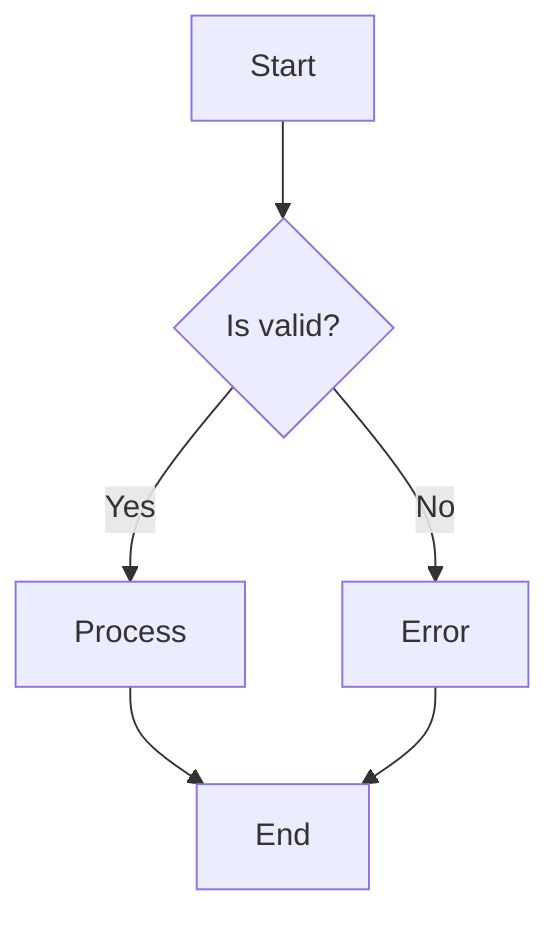
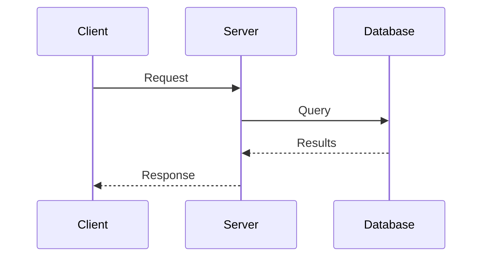
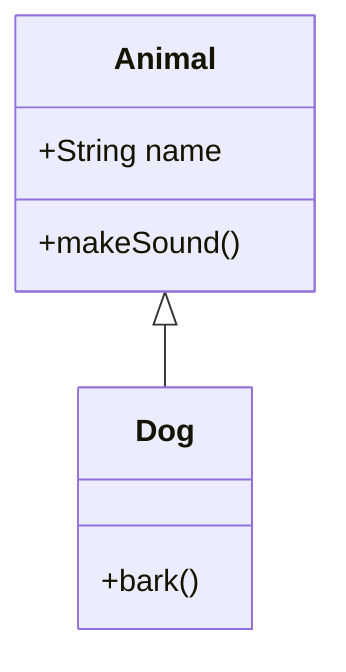
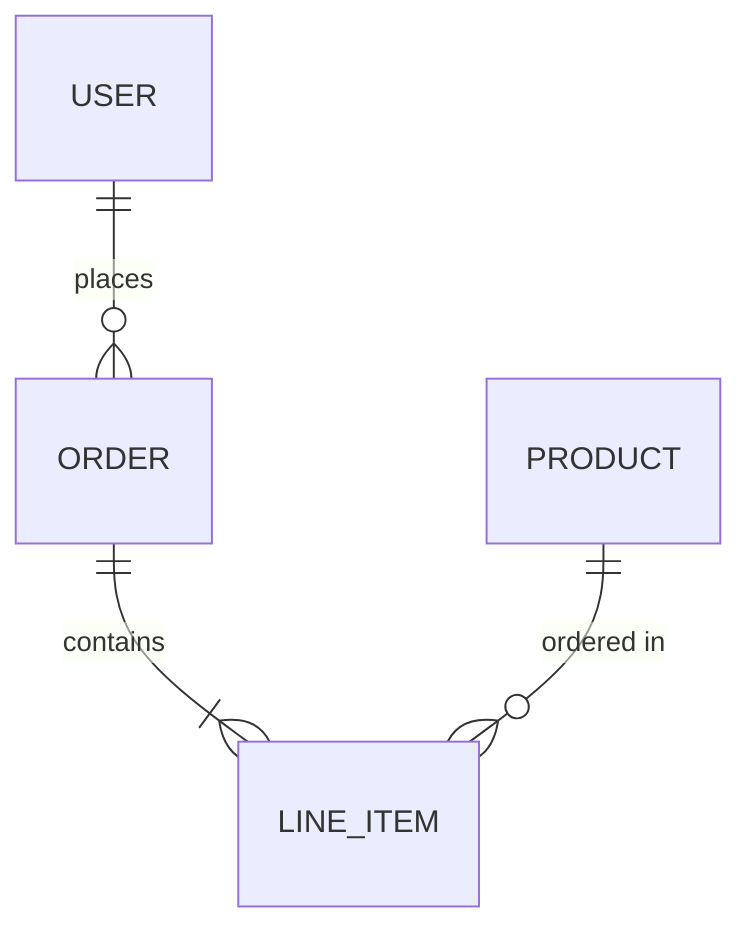

# Generate Mermaid Diagram

## Overview
Analyze the provided code, architecture, or concept and generate a clear, well-structured Mermaid diagram that visualizes relationships, flow, or structure.

## Instructions
1. **Analyze the input**: Determine what the user wants to visualize (code flow, architecture, data relationships, state machines, sequences, etc.).
2. **Choose the appropriate diagram type**:
   - `flowchart` — Process flows, decision trees, algorithms
   - `sequenceDiagram` — API calls, message passing, request/response flows
   - `classDiagram` — Class structures, inheritance, interfaces
   - `erDiagram` — Database schemas, entity relationships
   - `stateDiagram-v2` — State machines, lifecycle flows
   - `graph TD/LR` — Dependency graphs, module relationships
   - `gitGraph` — Git branching strategies
   - `journey` — User journeys
   - `gantt` — Timelines and schedules
3. **Generate the diagram** with these qualities:
   - Clear, descriptive node labels
   - Logical grouping with subgraphs where appropriate
   - Consistent styling and direction
   - Meaningful relationship labels on edges
   - Avoid excessive complexity; split into multiple diagrams if needed
4. **Output format**: Always wrap the diagram in a Mermaid code block:
   ```mermaid
   [diagram code here]
   ```

## Diagram Style Guidelines
- Prefer descriptive IDs (e.g., `UserService`, not `a1`)
- Add labels to relationships when they improve clarity
- Use subgraphs to group related components
- Keep diagrams readable (aim for ~15–20 nodes per diagram)
- Use appropriate arrow styles:
  - `-->` solid (main flow)
  - `-.->` dotted (optional/async)
  - `==>` thick (important path)
  - `o--` circle end (aggregation)
  - `*--` diamond end (composition)

## Examples

### Flowchart


### Sequence Diagram


### Class Diagram


### ER Diagram


## After generating
- Briefly explain what the diagram shows
- Offer to refine or expand specific sections
- Suggest alternative diagram types if applicable
