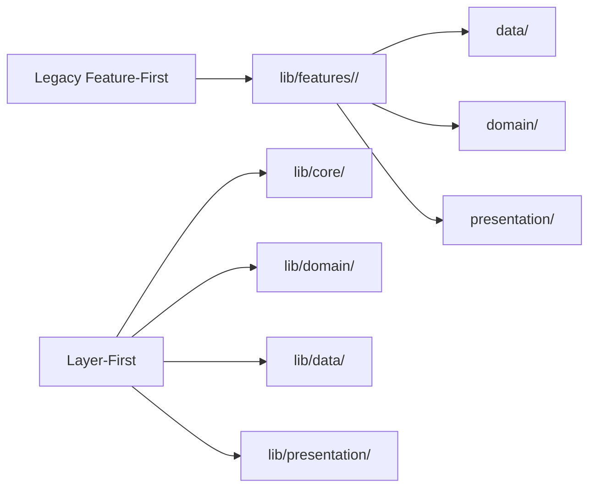
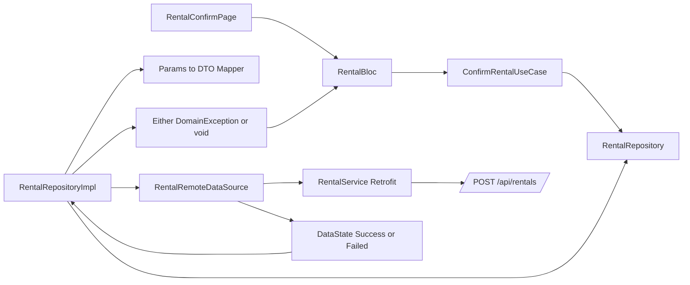
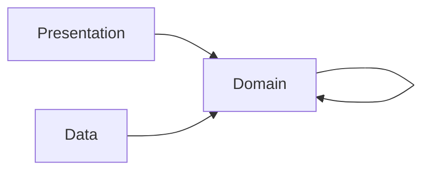

# Architecture Diagrams

## Current Migration State

The codebase is currently in a **hybrid migration** state:
- Existing features continue using `lib/features/<feature>/{data,domain,presentation}`.
- New or refactored flows can live in shared layer-first folders:
  - `lib/domain/`
  - `lib/data/`
  - `lib/presentation/`

The Rental flow was migrated to layer-first as the first vertical slice.

## Clean Architecture Overview
```mermaid
flowchart TB
  subgraph Presentation
    UI[Widgets and Pages]
    State[State Management (BLoC)]
  end

  subgraph Domain
    UC[Use Cases]
    Ent[Entities and Params]
    RepoI[Repository Interfaces]
  end

  subgraph Data
    RepoImpl[Repository Implementations]
    DS[Data Sources]
    DTO[DTOs and Mappers]
    Service[Retrofit Services]
  end

  UI --> State --> UC
  UC --> Ent
  UC --> RepoI
  RepoImpl --> RepoI
  RepoImpl --> DS
  DS --> Service
  RepoImpl --> DTO
```

## Module Layout During Migration


## Rental Refactor Flow (Layer-First)


## Dependency Direction


## Core Error and Result Contracts
- Data layer returns `DataState<T>` and converts transport failures to `DataException`.
- Repository layer converts `DataState<T>` to `Either<DomainException, T>`.
- Domain and presentation consume `Either` and should not depend on transport-specific exceptions.
