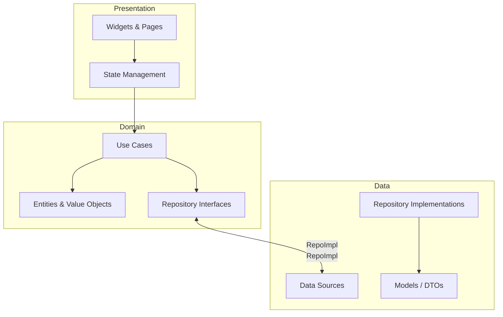
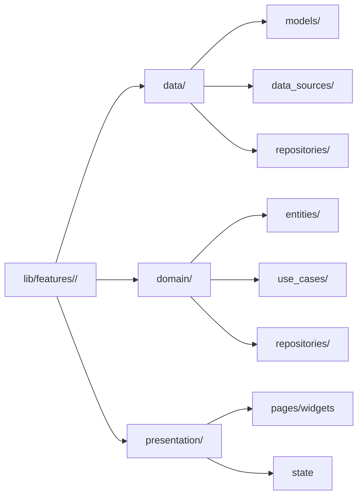
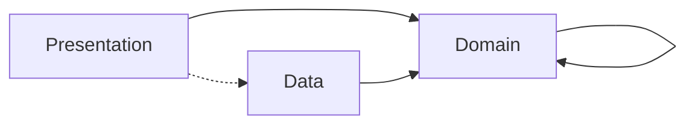

# Architecture Diagrams

## Clean Architecture Overview

```mermaid
flowchart TB
  subgraph Presentation
    UI[Widgets & Pages]
    State[State Management]
  end

  subgraph Domain
    UC[Use Cases]
    Ent[Entities & Value Objects]
    RepoI[Repository Interfaces]
  end

  subgraph Data
    RepoImpl[Repository Implementations]
    DS[Data Sources]
    DTO[Models / DTOs]
  end

  UI --> State --> UC
  UC --> Ent
  UC --> RepoI
  RepoI <-- RepoImpl
  RepoImpl --> DS
  RepoImpl --> DTO
```

## Feature Module Layout

```mermaid
flowchart LR
  Feature[lib/features/<feature>/] --> Data[data/]
  Feature --> Domain[domain/]
  Feature --> Presentation[presentation/]
  Data --> Models[models/]
  Data --> Sources[data_sources/]
  Data --> Repos[repositories/]
  Domain --> Entities[entities/]
  Domain --> UseCases[use_cases/]
  Domain --> ReposI[repositories/]
  Presentation --> UI[pages/widgets]
  Presentation --> StateMgmt[state]
```

## Dependency Direction

```mermaid
flowchart LR
  Presentation --> Domain
  Data --> Domain
  Domain --> Domain
  Presentation -.-> Data
```
